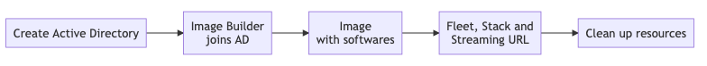

# Automating AppStream deployments

`AppStream`은 직방에서 AppStream 관리 및 배포를 위해 만든 툴 입니다. `AppStream`을 통해 원하는 AppStream의 생성 및 배포를 명령어 하나로 관리할 수 있습니다.

## Why create such a thing?

`AppStream`은 다음 2가지 철학을 근간으로 만들어 졌습니다.

### Fully automated and Code-driven

AppStream 이미지를 만들기 위해서는 사람의 손이 너무 많이 가는 문제가 있습니다. 이를 해결하기 위해서는 AppStream 이미지 및 스택을 만드는 프로세스가 모두 자동화가 되어야 하고 코드로 관리가 가능해야 합니다. `AppStream`을 이용할 경우 간단한 설정 파일 하나로 최신의 운영체제 및 원하는 소프트웨어들을 설치할 수 있고 이를 배포 할 수 있습니다.

직방에서는 여러 형태의 AppStream을 제공해야 합니다. 예를 들어 특정 VPC 안에서 제한된 네트워크로 구동 되어야 하는 경우, 특정 램 이상의 환경으로 구동 되어야 하는 경우, 그래픽 가속이 필요한 경우 등 다양한 케이스들을 설정 파일들로 분리하여 지속적으로 배포하여 운영 하고 있습니다.

### Up-to-date

운영체제 및 소프트웨어는 지속적으로 발전하지만 한편으로는 항상 보안의 위협에 놓여 있습니다. `AppStream`은 성능, 기능 그리고 보안을 고려하여 최신 버전의 소프트웨어를 항상 기본값으로 적용합니다. 물론 특정 버전의 소프트웨어도 지정할 수 있습니다.

직방에서는 `AppStream`을 이용하여 매일 혹은 필요 시 마다 AppStream을 배포하여 사용하고 있고 배포 시마다 최신 혹은 특정 버전의 운영체제 및 소프트웨어를 적용 합니다.


## Getting Started

### Prerequisites

* [AWS Command Line Interface](https://aws.amazon.com/cli/)

### Install `AppStream`

```
> npm init
> npm install @zigbang/appstream --save-dev
```

혹은 그냥 global mode로 설치 해도 됩니다.

```
> npm install -g @zigbang/appstream
```

### Create a config file
아래과 같은 내용으로 `chrome.json` file 을 만듭니다.

```
{
	"awsAccessKeyId": "<Your AWS Access Key ID>",
	"awsSecretAccessKey": "<Your AWS Secret Access Key>",
	"awsRegion": "<Your AWS Region>",
	"vpc": "<Your AWS VPC ID>",
	"availabilityZone": "<Your AWS AvailabilityZone>",
	"subnet": "<Your AWS Subnet ID>",
	"cidr": "x.x.x.x/x",
	"keyPair": "<Your AWS EC2 Key Pair>",
	"s3BucketUrl": "<Your AWS S3 Bucket URL>",
	"imageBuilderName": "zigbang-Chrome",
	"imageName": "zigbang-Chrome",
	"fleetName": "zigbang-Chrome",
	"stackName": "zigbang-chrome",
	"instanceType": "stream.standard.medium",
	"applications": [
		{
			"id": "Chrome",
			"packageName": "googlechrome",
			"path": "C:\\\"Program Files\"\\Google\\Chrome\\Application\\chrome.exe",
			"displayName": "Chrome"
		}
	]
}
```

### Create an AppStream

```
> npx appstream deploy ./chrome.json
```
또는

```
> npx -p @zigbang/appstream appstream deploy ./chrome.json
```

### Delete an AppStream 
```
> npx appstream destroy ./chrome.json
```

## Configuration

### Root

| Variable           | Required | Type | Description                                                                                                                                                                                                                                                         |
| ------------------ | -------- | -----| ------------------------------------------------------------------------------------------------------------------------------------------------------------------------------------------------------------------------------------------------------------------- |
| awsAccessKeyId     | o        | String |`AppStream`의 배포 과정에서 Active Directory에서 Image Builder 배포 시 필요한 AWS IAM Access Key ID                                                                                                                                                                 |
| awsSecretAccessKey | o        | String |`AppStream`의 배포 과정에서 Active Directory에서 Image Builder 배포 시 필요한 AWS IAM Secret Access Key                                                                                                                                                             |
| awsRegion          | o        | String |`AppStream`의 배포 과정에서 사용할 AWS Region [AWS Region Endpoints List](https://docs.aws.amazon.com/general/latest/gr/rande.html) 참고                                                                                                                            |
| vpc                | o        | String |`AppStream`의 배포 과정에서 사용하고 Fleet이 만들어지는 VPC의 ID                                                                                                                                                                                                    |
| availabilityZones  | o        | String |`AppStream`의 배포 과정에서 사용하고 fleet에서 사용될 availabilityZones                                                                                                                                                                                             |
| subnet             | o        | String |`AppStream`의 배포 과정에서 사용하고 fleet에서 사용될 subnet의 ID                                                                                                                                                                                                   |
| cidr               | o        | String |`AWS Subnet` Ip prefix (ex. 172.16.1.0/24)                                                                                                                                                                                                                          |
| keyPair            | x        | String |`AppStream`의 배포 과정에서 생성되는 EC2에 바인딩될 Key Pair의 이름                                                                                                                                                                                                 |
| s3BucketUrl        | o        | String |`AppStream`이 배포 과정에서 사용할 파일을 임시 저장하는 S3 버킷 URL                                                                                                                                                                                                 |
| applications       | o        | String[] | 설치할 소프트웨어의 목록                                                                                                                                                                                                                                            |
| imageBuilderName   | o        | String |`AppStream Image Builder` 이름                                                                                                                                                       
| baseImage   | x        | String |`AppStream Image Builder`에서 생성할 Base Image, [AppStream Base Image List](https://docs.aws.amazon.com/appstream2/latest/developerguide/base-image-version-history.html) 참고<br>               `ex) AppStream-Graphics-G4dn-WinServer2019`로 값을 넣으면 해당 이미지 중 Release Date 중 가장 최신인 이미지를 가져옴(현재 기준: `AppStream-Graphics-G4dn-WinServer2019-07-16-2020`)<br>        `기본값: AppStream-WinServer2019`               |
| imageName          | o        | String |`AppStream Image` 이름                                                                                                                                                                                                                                              |
| fleetName          | o        | String |`AppStream Fleet` 이름                                                                                                                                                                                                                                            |
| fleetEnableDefaultInternetAccess?          | x        | Boolean |`AppStream Fleet`에서 Internet Access 허용 유무<br>  `기본값: true`<br>NAT Gateway를 사용할 경우 `false`로 설정 그리고 사용할 `subnet`이 Private Subnet인지 확인                                                                                                                                                                                                                                                |
| fleetDesiredInstances        | x        | Number |`AppStream Fleet`에서 사용할 Instance의 갯수<be> `Max: 10, 기본값: 5                 ` [Fleet Auto Scaling](https://docs.aws.amazon.com/appstream2/latest/developerguide/autoscaling.html) 참고                                                                                                                                                                              |
| fleetType         | x        | String |`AppStream Fleet`에서 Desktop까지 제공할 경우: `ALWAYS_ON`, Application만 제공할 경우: `ON_DEMAND`<br> `기본값:       ON_DEMAND`                                                                                                                                                                                                                                      |
| stacktName         | o        | String |`AppStream Stack` 이름                                                                                                                                                                                                                                              |
| instanceType       | o        | String |`AppStream Image Builder` 및 `Fleet`에서 사용 하는 VM instance 유형 (ex. stream.standard.medium) [AppStream Instance Type List](https://aws.amazon.com/appstream2/pricing/#:~:text=Amazon%20AppStream%202.0%20supports%20three,and%20Streaming%20URL%20(API).) 참고 |
| connectorType       | x        | String |`AppStream Stack`에서 사용 하는 Storage Type `GOOGLE_DRIVE, ONE_DRIVE, HOMEFOLDERS`<br> `기본값: HOMEFOLDERS` <br>[AppStream Storage Connector](https://docs.aws.amazon.com/AWSCloudFormation/latest/UserGuide/aws-properties-appstream-stack-storageconnector.html#cfn-appstream-stack-storageconnector-connectortype) 참고|
| domain         | x        | String[] |`AppStreamStack`                                                                                                                                                   에서 Storage Connector 중 `GOOGLE_DRIVE` 혹은 `ONE_DRIVE` 사용 시 Access 가능한 Domain 지정 (ex. `zigbang.com`)<br> `기본 값: undefined`                  |

### Application

Image Assistant CLI의 상세한 옵션은 다음 URL을 참고 하세요.

* https://docs.aws.amazon.com/appstream2/latest/developerguide/programmatically-create-image.html

| Variable    | Required | Type   | Description                                                   |
| ----------- | -------- | ------ | ------------------------------------------------------------- |
| id          | o        | String | Image Assistant CLI `add-application`의 `--name`              |
| packageName | o        | String | [Chocolatey](https://chocolatey.org/) 패키지명                  |
| path        | o        | String | Image Assistant CLI `add-application`의 `--absolute-app-path` |
| displayName | o        | String | Image Assistant CLI `add-application`의 `--display-name`      |


### Scripts 
| Variable    | Required | Type     | Description                                                            |
| ----------- | -------- | -------- | ---------------------------------------------------------------------- |
| Scripts     | x        | String[] | `AppStream Image Builder`에 추가적인 Powershell 설정이 필요한 경우 해당 옵션 사용 |

## How It Works Internally

`AppStream`의 자동화는 Image Builder Windows에서의 Remote Management (WinRM)에 의존성이 높습니다. 이미 AWS에서 제공하는 많은 글들을 통해 Image Builder가 특정 전제 조건을 만족할 경우 원격으로 명령어를 실행하여 자동화하는 방법을 제공하고 있습니다.

* [How to use SSM Run to perform programmatic actions on AppStream 2.0 image builders](https://aws.amazon.com/blogs/desktop-and-application-streaming/how-to-use-ssm-run-to-perform-programmatic-actions-on-appstream-2-0-image-builders/)

전제 조건중 가장 중요한 부분은 Image Builder가 원격으로 명령을 받을 수 있는 환경이어야 한다는 점 입니다. 다만 대부분의 가이드는 Image Builder에 사람이 접속을 하여 활성화를 해줘야 한다는 점에서 사람의 개입이 있을 수 밖에 없어서 완전 자동화를 이룰 수 없는 한계점이 있습니다.

이를 해결하기 위해서 `AppStream`은 사전에 Active Directory를 하나 생성합니다. 이 Active Directory의 역할은 Image Builder로 하여금 원격 명령을 받을 수 있는 정책을 내려주는 역할을 합니다. 그게 다입니다! 이를 통해 Image Builder는 도메인에 조인을 하고 GPO를 통해 원격 명령을 받을 수 있는 정책을 내려 받고 이후 Image Builder는 원격 명령을 내릴 수 있는 상태로 변경이 됩니다. 이 다음부터는 여러분들의 상상에 의해 자유롭게 Image Builder를 통해 원하는 이미지 생성을 하면 됩니다.

`AppStream`이 구동되는 전체적인 workflow는 다음과 같습니다.



1. Active Directory를 생성
   * WinRM 설정을 내려주는 GPO를 생성
2. Image Builder 생성 및 위에서 생성된 AD에 조인
3. Image Builder에 필요한 소프트웨어 설치 및 설정
4. Image 생성
   * 항상 최신 agent를 적용
5. Fleet, stack 및 streaming URL 생성
2. Clean up resources

